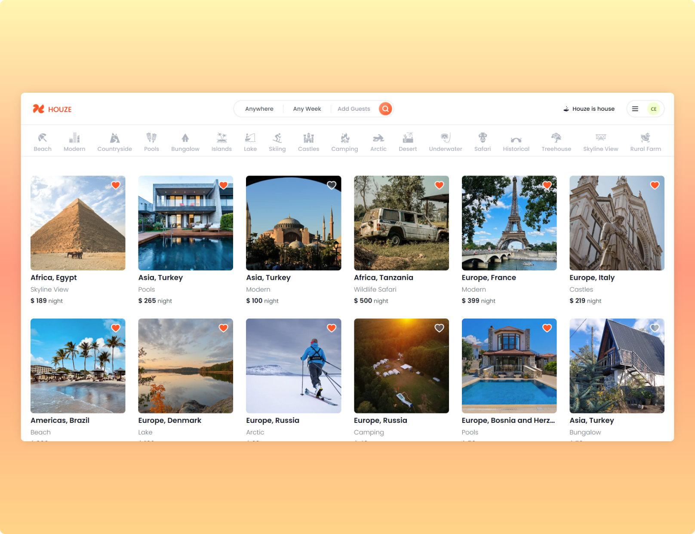

# Houze

The Best hotels are on Houze. Compare hotel prices, book hotels without prepayment. Read the latest customer reviews. See the latest pictures of hotels.

## Features

- Users can sign up and log in.
- Users can search for and list accommodations.
- Users can make reservations and manage their bookings.
- Users can add accommodations to their favorites.
- Users can leave reviews for accommodations.
- Admin users can add, edit, and delete accommodations.

## Technologies

- **Next.js:** A React-based framework that provides both client-side and server-side rendering.
- **TypeScript:** A programming language that offers static type-checking.
- **MongoDB:** A NoSQL database system.
- **Prisma:** An ORM (Object-Relational Mapping) tool that simplifies database operations.
- **Tailwind CSS:** A utility-first CSS framework for building responsive and modern user interfaces.
- **Leaflet:** An open-source JavaScript library for interactive maps.
